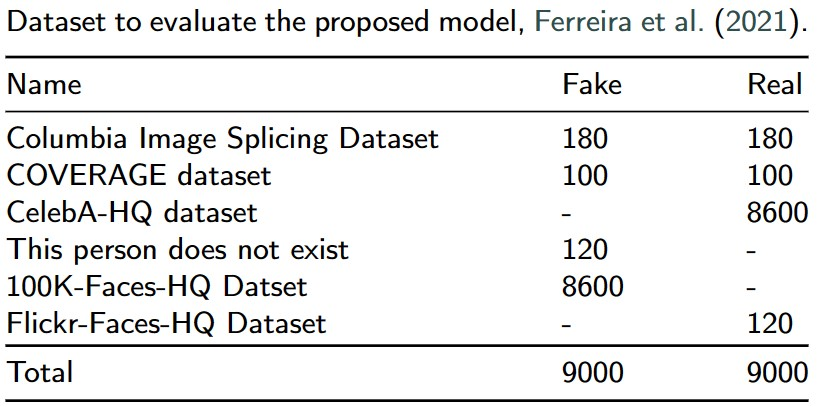
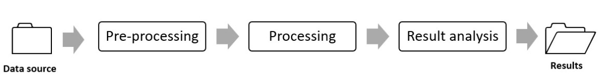
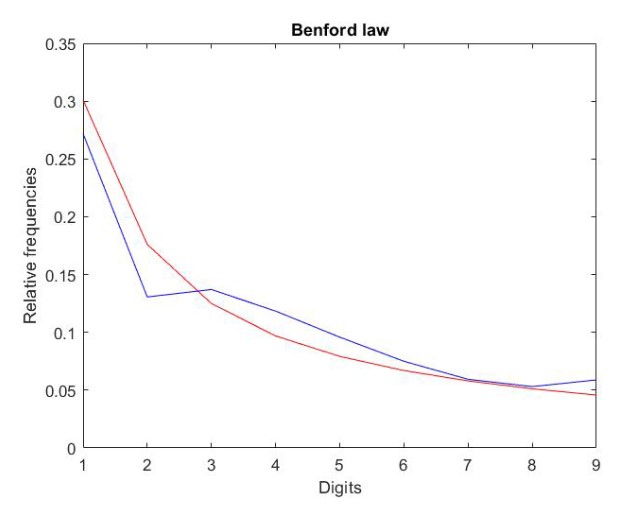

# Authors

+ Pedro Fernandes - Department of Computer Engineering; Limerick Institute of Technology; Limerick, Ireland; Pedro.Fernandes@lit.ie
; Mathematics Department; Polytechnic Institute of Leiria; Leiria, Portugal; pedro.a.fernandes@ipleiria.pt
                  

+ Mário Antunes - Computer Science and Communication Research Centre (CIIC), School of Technology and Management, Polytechnic of Leiria; Leiria; Portugal;   mario.antunes@ipleiria.pt
INESC TEC, CRACS; Porto; Portugal

# Benford's law-based method

Several scripts are presented, some built-in Python (Conversion, Extract-features) and others in Matlab (Extract first digits, Tables CVM, Spearman and Pearson). The procedure is started by extracting the first digits from a database containing manipulated and authentic images (Extract-features). 
Subsequently, the obtained values are stored in a database and converted from .py format to .xls format (Conversion). The first digit is extracted from this database, and the hypothesis tests (Pearson, Spearman and Cramer Von Mises) are applied. 
This procedure will allow the classifications. This entire classification procedure can be carried out by calculating the P-Value obtained from the correlation between the empirical frequency of occurrence of the digits from Benford's law and the relative frequencies of the digits extracted from the set of images.

# Dataset containing manipulated and authentic images

The database used for the tests is available [here]

# General architecture of the method based on Benford's law

The pre-processing consists in extracting a set of n features from the images by applying the DFT (Discrete Fourier Transform) method. For this, a Python script was built, where besides the standard libraries NumPy, pickle, the libraries OpenCV were used to process the image. A script was built for the radial profiling function, whose main function is to create a circular boundary in the image, extracting only the features within the circular zone. The extracted data is stored in a dataset, where through the development of a script built in MatLab, the first digit of all the obtained values was extracted and subsequently stored in a digit matrix.

The data relating to the extraction of the first digit from each image is appropriately stored into a feature vector, and each is labelled, that is, if the image is original, it is assigned the label 1;  otherwise, the image is manipulated and is assigned the labelled with 0.

At the end of pre-processing, an adequately labelled dataset is available to apply a set of hypothesis tests based on Pearson, Spearman and Cramer-Von Mises statistical models. 

The processing phase consists of two steps. The first step consists in counting the first digits from the values obtained in the pre-processing phase for each image. In contrast, the second step calculates the absolute frequency of each digit, having the whole database as a reference. Then, the relative frequency of the values obtained in the two previous steps is calculated, consisting of the quotient between the absolute frequency of each digit and the sum of the total number of digits of each image under study, allowing the subsequent comparison with Benford's law. Finally, the values obtained by the relative frequency calculation are duly stored in a data set for further investigation, determined by two significant moments: hypothesis tests and graphically.

# Dataset to evaluate the proposed model

The table below details the datasets collected and used in the experiments.

| Name | Fake | Real | 
| ---- | ---- | ---- | 
| [Columbia Image Splicing Dataset](https://www.ee.columbia.edu/ln/dvmm/downloads/AuthSplicedDataSet/AuthSplicedDataSet.htm) | 180 | 180 | 
| [Coverage Dataset](https://github.com/wenbihan/coverage) | 100 | 100 |  
| [CelebA-HQ Dataset](https://arxiv.org/abs/1710.10196) | - | 8600 |  
| [This person does not exist] (https://thispersondoesnotexist.com/)| 120 | - |  
| [100K-Faces-HQ Dataset](https://generated.photos/) | 8600 | - |  
| [Flickr-Faces-HQ Dataset](https://arxiv.org/abs/1812.04948) | - | 120 |  
| Total | 9000 | 9000 |  |

Important note: 
This dataset only contains photos.
The final dataset is labelled correctly and consists of 9000 manipulated photographs labelled 0 and 9000 authentic photos labelled 1. 
You can find the final dataset [here]() 

#Results obtained after extracting 200, 500 and 1000 features from the images dataset, using Pearson

|  | TP | TN | FP| FN | PR | RE | F1 | AC | 
| ---- | ---- | ---- | ---- | ---- | ---- | ---- | ---- | ---- |
| 200 | 8529 | 7628 | 1372 | 471 | 0.8614 | 0.9477 | 0.9025 | 0.8976 |
| 500 | 8529 | 7686 | 1314 | 471 | 0.8665 | 0.9477 | 0.9053 | 0.9008 |
| 1000 | 8521 | 7674 | 1326 | 479 | 0.8653 | 0.9468 | 0.9042 |  0.8997 |
| Mean | 8526 | 7662 | 1337 | 474 | 0.8644 | 0.9474 | 0.9040 |  0.8993 |

# Benchmark results

| Model | PR | RE | F1 | AC | Time |
| ------------ | ------------ | ------------ | ------------ | ------------ | ------------ | 
| DFT with SVM | 0.9965 | 0.9941 | 0.9953 | 0.9951 | 00:00:51 |
| CNN | 0.9970 | 0.9966 | 0.9968 | 0.9967 | 06:36:00 |
| BL - Pearson | 0.8644 | 0.9474 | 0.9040 | 0.8993 | 00:25:23 |

